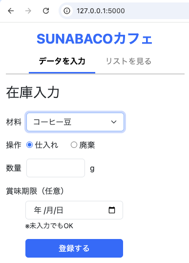
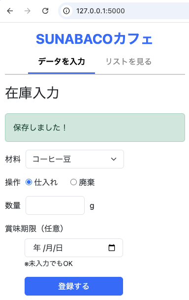
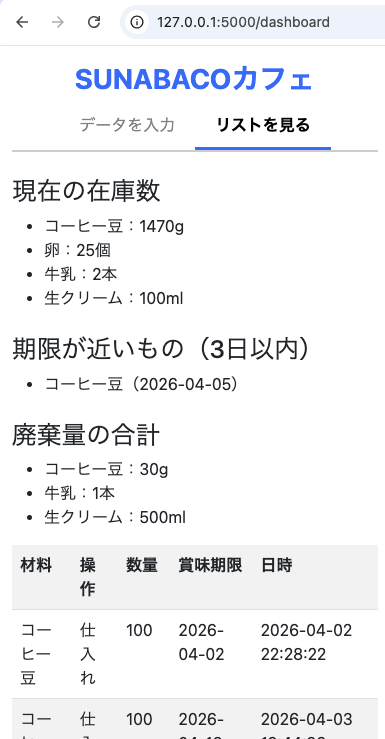

# flask-inventory-app

FlaskとSQLiteを使って作成した、シンプルな在庫管理アプリです。
スクール課題として制作しました。

## できること
- 在庫の入力
- 在庫リストの表示
- スマホでの操作を想定した画面構成

## 使用技術
- Python
- Flask
- SQLite
- Bootstrap

## 補足SQLiteのデータベースは起動時に自動生成されます。

## 画面イメージ

### 在庫入力

### 登録後

### リスト
